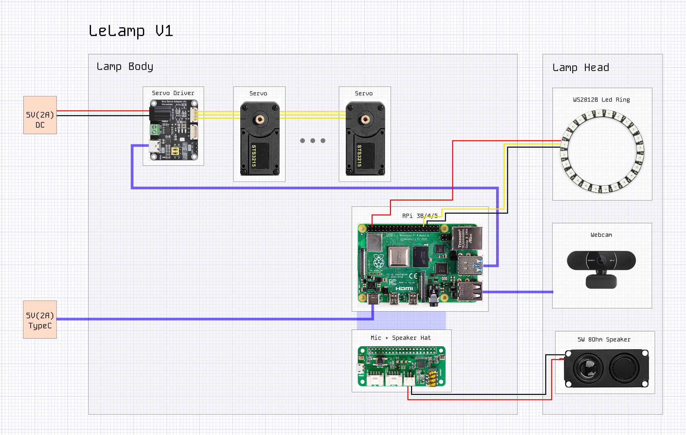

# Electrical Components

**Complete Bill of Materials**: Bill of materials for LeLamp can be found [here](https://docs.google.com/spreadsheets/d/1C50qqSxJjCHEnh6j_Dcfx8JzyLlGobKSOYA0ePJUDVk/edit?gid=1580017414#gid=1580017414). If you have collected all parts required for LeLamp, you can proceed.

## Structure

LeLamp is divided into two main sections:

- **Lamp Body** – Houses the mechanical actuation and power conversion systems. This includes:

  - High-torque servos for movement
  - A servo driver board for precise positioning

  Think of the Lamp Body like the human torso—it contains the “muscles” (servos) and “circulatory system” (power delivery) that keep the whole device moving.

- **Lamp Head** – Contains the computing and expressive modules, including:

  - Raspberry Pi 3B/4/5 for control and connectivity
  - WS2812B RGB LED ring for expressive lighting
  - Microphone and speaker system for audio interaction

  The Lamp Head is like a human head—it houses the “brain” (Pi), the “ears” (microphone), and the “mouth” (speaker and LEDs).

You can build a functional LeLamp without most of the head components—or even without the head entirely—if you prefer to control the servos directly from an external computer.

## Power

You'll need 2 power supplies to power LeLamp:

1. **A 5V 2A DC Power Supply With DC Plug**: This is used to provide power to the servos.
2. **A 5V 2A Type C Charger**: This is used to provide power to the Rasperry Pi.

You can reduce the amount of power supply to 1 by providing the 5V from the motor driver to the pi. However, this is not recommended and has high risk of bricking your Pi.

---

**Previous**: [3D Print](./1.%203D%20Print.md) | **Next**: [Servos](./3.%20Servos.md)
