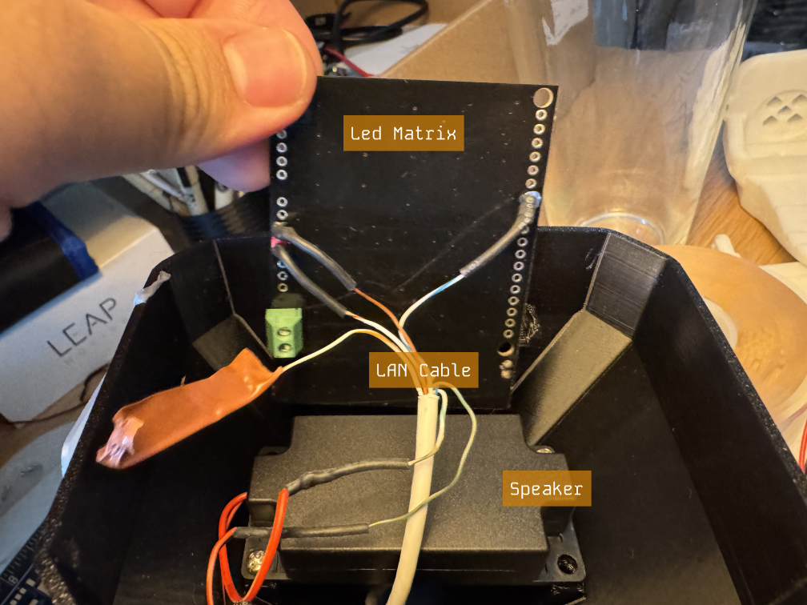
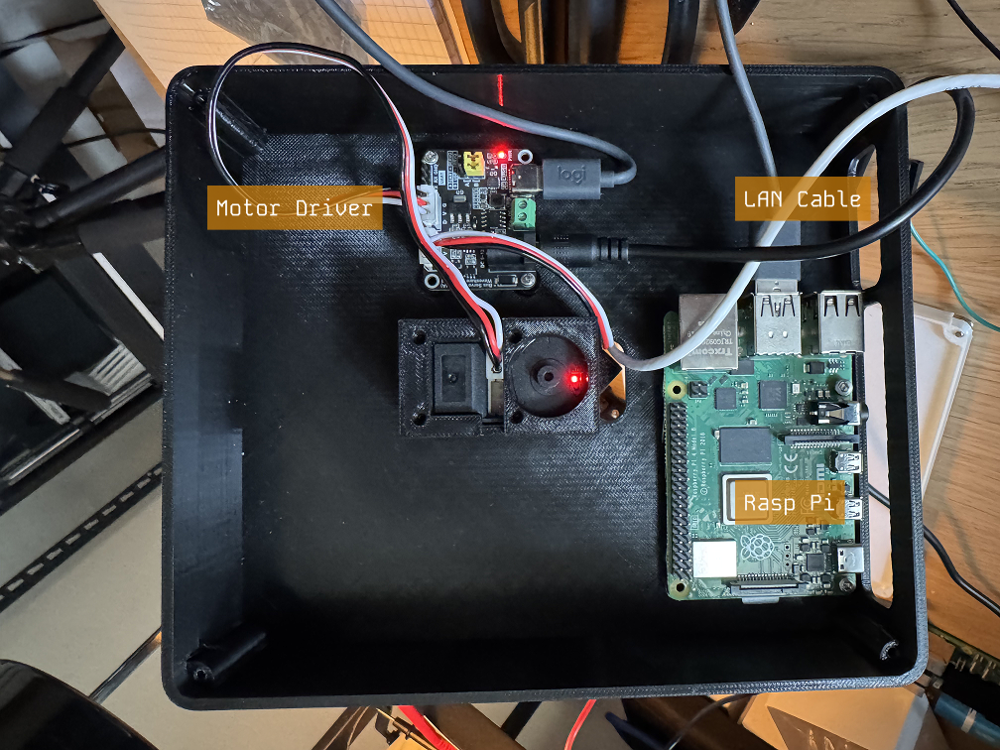
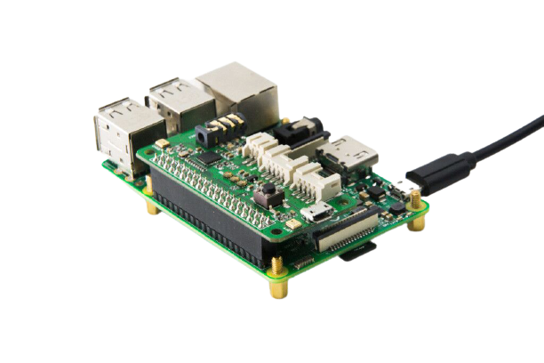

# 🛠️ LeLamp Assembly Guide

**⏱️ Estimated time:** 1–2 hours
**🔧 Required tools:** Soldering iron, screwdrivers, heat insert tool  
**📦 Required components:** Raspberry Pi, ReSpeaker Hat, speaker, LED Matrix, SD card, servo driver

## Overview

LeLamp consists of three main sections: the **Head**, the **Base**, and the **Body**, each containing essential functional components.

### LeLamp Head

- **Speaker** — 4 Ω / 3 W audio output
- **LED Matrix** — WS2812B programmable LEDs for expression

### LeLamp Base

- **Raspberry Pi with ReSpeaker Hat** — Controls servos, audio, and LEDs
- **Motor Driver** — Drives the servo motors

### LeLamp Body

- **Motors** - Actuators of the Lamp

All connections between the Head and Base are made through a **stripped Ethernet cable**, which carries power and data signals. Connections from the Base to motors are through the default wires given with each motor.

## Soldering and Assembly

### 1. Assembling the LeLamp Head

Use a **stripped Ethernet cable** to connect the speaker and LED matrix in the head to the base. The image below shows the general wiring layout:

1. **Prepare the Ethernet cable:** Strip the insulation to expose the individual wires.
2. **Solder connections:**
   - Solder each Ethernet wire to the pads of the **speaker** and **LED matrix**.
   - Keep track of which wire connects to which pad (e.g., GND, 5V, Data).
3. **Follow color conventions:**
   - **Black** — GND
   - **Red** — 5V
   - **Yellow** — Data
4. If you’re unfamiliar with WS2812B LED wiring, refer to this [tutorial](https://lastminuteengineers.com/ws2812b-arduino-tutorial/).
5. The image above also indicates the **orientation and placement** of the speaker and LED matrix inside the head.

> 💡 _Tip:_ You may also use individual wires instead of an Ethernet cable, as long as each wire is at least **50 cm** long to reach from the head to the base.

### 2. Assembling the LeLamp Base

1. **Mount the electronics:**
   - Secure the **motor driver board** and **Raspberry Pi** inside the base as shown above.
2. **Connect the boards:**

   - Use a **USB Type-C cable** to connect the motor driver to the Raspberry Pi.

3. **Prepare the ReSpeaker Hat:**

   - Solder the **header pins** on the ReSpeaker Hat as shown in the image.

   

4. **Connect the ReSpeaker Hat as shown in below image**
   
5. **Connect the head wiring:**
   - On the other end of the Ethernet cable (coming from the lamp head), solder **female header connectors** to each wire and **JST2.0 male** to the speaker wire.
   - Carefully match each wire to the corresponding pin on the ReSpeaker Hat, following the **schematics** for correct connections. You can connect the JST2.0 of speakers directly to the speaker port on the respeaker hat.

> ⚠️ _Reminder:_ Double-check all connections before powering on. Incorrect wiring can damage components.

### 3. Assembling LeLamp Body

The best way to assemble LeLamp Body is to reference the [OnShape's Assembly](https://cad.onshape.com/documents/16c9706360b5ad34f9c8db49/w/2edfa54c83253c120fbc9e58/e/a35eec618cd78ea5d74bf01b).

Using this 3D viewer, you can reference exactly the orientation and placement of each motor and part of the lamp.

For convenience, the 2D view of motors can be found below.

**Please read through this whole section before you assemble the motors onto your Lamp**.

## Motor Assembly

Each STS3215 servo motor comes with two motor horns — one with gears and one without. Before mounting the servos onto the lamp structure, first attach the geared horn to the motor’s output side (the side with the copper gear) and secure it firmly with screws. On the opposite side, place the non-geared horn; this one does not need to be screwed in, as it serves only for axis alignment.

Because the motor body is asymmetrical, the orientation of the motor horns is critical to ensure proper movement and reliability. Refer to the reference images below to confirm correct positioning.

### Motor Placement

### Motor Orientation

Use the side of the motor with the geared horn for installation. When viewing LeLamp from the top-down, with the wire slit on the base (or wire hole on newer versions) facing right, the pitch servo horns (the ones with gears) should be oriented outward, facing away from you—that is, toward the front of the lamp.

**For the yaw and roll servos, you don't need to attach the axis alignment horn.** Their orientation can be refereced in above image.

Again, if you are unsure, referece the 3D viewer from above.

### Motor Wiring

You should install all motors in their designated positions before wiring them. The motors are daisy-chained in sequence, starting from the Wrist Pitch Servo and ending at the Base Yaw Servo, which connects directly to the motor driver.

Refer to the schematics or the lamp base image above for proper wiring orientation and connection order.

> ⚠️ _Reminder:_ If your motor wire isn't long enough, you have to extend them through another wire by [splicing the wires](https://www.youtube.com/watch?v=r7GlDBge_WU).

## Assembly Completion Checklist

After completing lamp assembly, verify:

- [ ] All parts are connected
- [ ] An assembled LeLamp

## What You Should Have

At this stage, you should have:

- **Functional head assembly** with all electronics working
- **Proper cable management** with wires routed through head structure

---

**Previous**: [Servo Setup](./3.%20Servos%20Setup.md) | **Next**: [LeLamp Setup](./5.%20LeLamp%20Setup.md)
